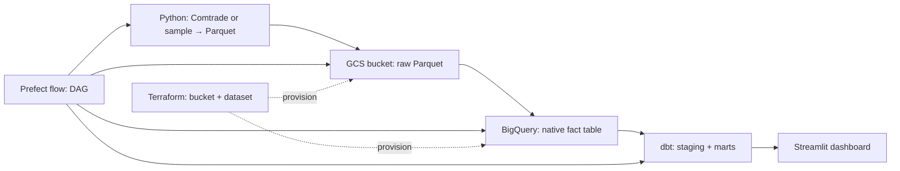

# Global Trade Shocks

**Which partners and products moved?** A small end-to-end analytics pipeline that lands monthly bilateral trade facts in a **cloud data lake**, loads a **partitioned BigQuery warehouse**, models **dbt** marts for a **Streamlit** dashboard, and orchestrates everything with **Prefect** (workflow engine — same role as Airflow: DAGs, schedules, retries).

This repository is **standalone** (not related to any other course repo).

### Data sources (important for peer review)

| Mode | Command | What it is |
|------|---------|----------------|
| **Real dataset (recommended for grading)** | `python flows/trade_pipeline.py --source comtrade` | [UN Comtrade](https://comtradeplus.un.org/) API → same Parquet schema as the rest of the pipeline. Needs network; optional `COMTRADE_SUBSCRIPTION_KEY` in `.env` for higher limits (see below). |
| **Offline demo** | `python flows/trade_pipeline.py` (default) or `--source sample` | Deterministic **synthetic** panel with the same columns — useful when you have no API access or want a quick UI check. |

For the course wording *“selecting a dataset of interest”*, treat **`--source comtrade`** as the primary path; use **`sample`** only as a reproducible fallback.

**Alignment with the course “Datasets” list:** The primary dataset is **UN international merchandise trade statistics** from **[UN Comtrade](https://comtradeplus.un.org/)** (official API via `scripts/fetch_comtrade.py`, wired into `python flows/trade_pipeline.py --source comtrade`). That matches the spirit of the course’s public trade / macro datasets. **Synthetic `sample` data** is only a schema-identical fallback when reviewers run the pipeline without network access.

---

## Problem

Policy shocks, conflicts, and supply-chain disruptions change trade patterns: some **partner countries** lose share, some **HS product chapters** spike. Operations and research teams need a repeatable pipeline from raw extracts to governed metrics. This project demonstrates that path on **GCP** with **IaC**, a **lake → warehouse → transform → BI** layout, and clear **partitioning/clustering** choices for the queries the dashboard runs.

---

## Architecture



| Layer | Technology |
|-------|-------------|
| Cloud | Google Cloud Platform |
| IaC | Terraform (`terraform/`) |
| Data lake | GCS (Parquet under `raw/trade_monthly/`) |
| Warehouse | BigQuery (partitioned + clustered fact) |
| Orchestration | Prefect (`flows/trade_pipeline.py`) |
| Transform | dbt (`dbt_trade/`) |
| Dashboard | Streamlit (`dashboard/app.py`) |

### Why this partitioning / clustering

- **`fct_trade_monthly`** is **partitioned by `trade_month`** so month-range filters in the time-series tile prune partitions.
- **Clustered by `partner_iso`, `hs_chapter`, `trade_flow`** because the fact grain is monthly bilateral trade by chapter and flow — grouping and filters in dbt/dashboard align with those columns.

---

## Prerequisites

- Python **3.11+**
- **Google Cloud** project + **service account** with roles such as *Storage Object Admin* and *BigQuery Data Editor* / *Job User* (tighten for production).
- **Terraform** `>= 1.5`

**dbt + BigQuery:** `dbt_trade/profiles.yml` uses **service-account JSON** auth. Set `GOOGLE_APPLICATION_CREDENTIALS` in `.env` to an **absolute path** to your key file. Application Default Credentials (`gcloud auth application-default login`) alone are **not** enough for `dbt run` with this profile.

---

## Quickstart

### 1) Clone and environment

```bash
cd global-trade-shocks
python3.11 -m venv .venv
source .venv/bin/activate
pip install -r requirements.txt
cp .env.example .env
# Edit .env — use absolute path for GOOGLE_APPLICATION_CREDENTIALS
mkdir -p creds && cp /path/to/sa.json creds/gcp.json
```

Point `GOOGLE_APPLICATION_CREDENTIALS` in `.env` to `.../global-trade-shocks/creds/gcp.json`.

### 2) Provision lake + warehouse shell (Terraform)

```bash
cd terraform
cp terraform.tfvars.example terraform.tfvars
# Edit terraform.tfvars: project_id, gcs_bucket_name (globally unique), credentials path
terraform init
terraform apply
cd ..
```

Sync bucket/dataset names into `.env` (`GCS_BUCKET`, `BQ_DATASET`, `GCP_PROJECT_ID`).

### 3) Run the pipeline (Prefect DAG)

From the repo root (with `.venv` active):

**Grading / real dataset path (UN Comtrade inside the DAG):**

```bash
python flows/trade_pipeline.py --source comtrade
```

**Offline / no API (synthetic panel):**

```bash
python flows/trade_pipeline.py --source sample
```

`--source` defaults to `sample` so clones without network still have a working path.

This runs, in order:

1. Build `data/raw/trade_monthly.parquet` (**Comtrade** or **sample**, per `--source`)
2. Upload to `gs://$GCS_BUCKET/raw/trade_monthly/`
3. Load BigQuery staging + rebuild **`fct_trade_monthly`** (partitioned/clustered)
4. `dbt run` for staging + marts

**Custom Comtrade parameters:** `python flows/trade_pipeline.py --source comtrade` runs `scripts/fetch_comtrade.py` with its built-in defaults (`python scripts/fetch_comtrade.py --help` for flags). To use another reporter, period, or commodity list, write Parquet to `data/raw/trade_monthly.parquet`, then run the lake → warehouse → dbt leg:

```bash
python scripts/upload_to_gcs.py --local data/raw/trade_monthly.parquet
python scripts/load_bq_from_gcs.py
dbt run --project-dir dbt_trade --profiles-dir dbt_trade
```

### 4) Dashboard

```bash
streamlit run dashboard/app.py
```

Open the local URL (Streamlit prints `http://localhost:8501`). Peers can reproduce the same view by cloning the repo, configuring `.env`, running the pipeline, and starting Streamlit. If your course asks for a link without local setup, add a short **Loom walkthrough**, **screenshots** in the repo, or deploy with [Streamlit Community Cloud](https://streamlit.io/cloud) using your own secrets management.

You should see:

1. **Tile 1 — categorical:** HS2 chapter mix of imports (bar chart + table).
2. **Tile 2 — temporal:** monthly import totals (line chart).

---

## Course rubric mapping (concise)

- **Cloud + IaC:** GCP + Terraform.
- **Lake + warehouse:** GCS Parquet → BigQuery native tables.
- **Orchestration:** Prefect flow with multiple sequential tasks (full DAG); data uploaded to the lake inside the flow.
- **Transformations:** dbt models (`stg_*`, `mart_*`).
- **Dashboard:** Streamlit, **≥ 2 tiles**, categorical + temporal, titled sections.
- **Dataset:** Real **UN Comtrade** extract via `--source comtrade`; synthetic **`sample`** for offline demos.
- **Reproducibility:** No hardcoded machine paths; configure via `.env` and `terraform.tfvars`.

---

## UN Comtrade extract (reference)

`scripts/fetch_comtrade.py` calls the official HTTPS endpoints used by the UN’s own Python client (`comtradeapicall`):

- **No key:** `public/v1/preview/...` (small row cap, good for demos).
- **With key:** set `COMTRADE_SUBSCRIPTION_KEY` in `.env` to use `data/v1/get/...` (register at [Comtrade Developer Portal](https://comtradedeveloper.un.org/)).

The script maps Comtrade JSON rows into the same Parquet columns as the generator (`trade_month`, `reporter_iso`, `partner_iso`, `hs_chapter`, `trade_flow`, `trade_value_usd`) and handles **timeouts, connection errors, 401/403/404, 5xx, and invalid JSON** with clear exit codes.

Example (public preview — small row cap):

```bash
python scripts/fetch_comtrade.py --period 202301 --reporter 36 --cmd-codes 91 --flow M --out data/raw/trade_monthly.parquet
```

## Submitting a zip (peer review)

Do **not** ship `.git/`, `__pycache__/`, `.venv/`, `*.tfstate*`, or your `.env` / service-account JSON inside a coursework zip. Prefer a clean export, for example:

```bash
git archive -o global-trade-shocks.zip HEAD
```

## CI

GitHub Actions workflow `.github/workflows/ci.yml` installs dependencies, byte-compiles Python, checks `python flows/trade_pipeline.py --help`, runs the **offline** generator, and performs an **optional, non-blocking** Comtrade smoke request (continues on failure if the API rate-limits).

## Optional extensions

- Add `prefect deployment build` / `prefect server start` for scheduled runs.
- Add unit tests around `comtrade_to_pipeline_df` (pure function — easy to test).

---

## New GitHub repository

This folder is a fresh `git init`. To publish:

```bash
gh repo create global-trade-shocks --private --source=. --remote=origin --push
# or create an empty repo on GitHub, then:
git remote add origin https://github.com/<you>/global-trade-shocks.git
git add -A && git commit -m "Initial import: global trade shocks pipeline"
git branch -M main
git push -u origin main
```

---

## License

MIT — use freely for coursework and portfolios.
