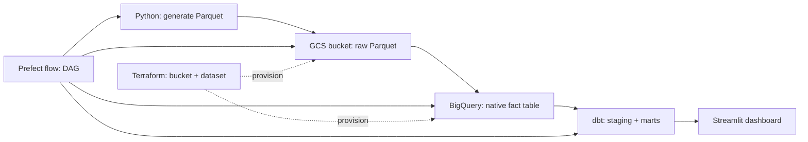

# Global Trade Shocks

**Which partners and products moved?** A small end-to-end analytics pipeline that lands monthly bilateral trade facts in a **cloud data lake**, loads a **partitioned BigQuery warehouse**, models **dbt** marts for a **Streamlit** dashboard, and orchestrates everything with **Prefect** (workflow engine — same role as Airflow: DAGs, schedules, retries).

This repository is **standalone** (not related to any other course repo). Synthetic trade data is generated locally so reviewers can reproduce results without API keys; you can later swap the extract step for [UN Comtrade](https://comtradeplus.un.org/) or national bulk files.

---

## Problem

Policy shocks, conflicts, and supply-chain disruptions change trade patterns: some **partner countries** lose share, some **HS product chapters** spike. Operations and research teams need a repeatable pipeline from raw extracts to governed metrics. This project demonstrates that path on **GCP** with **IaC**, a **lake → warehouse → transform → BI** layout, and clear **partitioning/clustering** choices for the queries the dashboard runs.

---

## Architecture



| Layer | Technology |
|-------|-------------|
| Cloud | Google Cloud Platform |
| IaC | Terraform (`terraform/`) |
| Data lake | GCS (Parquet under `raw/trade_monthly/`) |
| Warehouse | BigQuery (partitioned + clustered fact) |
| Orchestration | Prefect (`flows/trade_pipeline.py`) |
| Transform | dbt (`dbt_trade/`) |
| Dashboard | Streamlit (`dashboard/app.py`) |

### Why this partitioning / clustering

- **`fct_trade_monthly`** is **partitioned by `trade_month`** so month-range filters in the time-series tile prune partitions.
- **Clustered by `partner_iso`, `hs_chapter`, `trade_flow`** because the fact grain is monthly bilateral trade by chapter and flow — grouping and filters in dbt/dashboard align with those columns.

---

## Prerequisites

- Python **3.11+**
- **Google Cloud** project + **service account** with roles such as *Storage Object Admin* and *BigQuery Data Editor* / *Job User* (tighten for production).
- **Terraform** `>= 1.5`

---

## Quickstart

### 1) Clone and environment

```bash
cd global-trade-shocks
python3.11 -m venv .venv
source .venv/bin/activate
pip install -r requirements.txt
cp .env.example .env
# Edit .env — use absolute path for GOOGLE_APPLICATION_CREDENTIALS
mkdir -p creds && cp /path/to/sa.json creds/gcp.json
```

Point `GOOGLE_APPLICATION_CREDENTIALS` in `.env` to `.../global-trade-shocks/creds/gcp.json`.

### 2) Provision lake + warehouse shell (Terraform)

```bash
cd terraform
cp terraform.tfvars.example terraform.tfvars
# Edit terraform.tfvars: project_id, gcs_bucket_name (globally unique), credentials path
terraform init
terraform apply
cd ..
```

Sync bucket/dataset names into `.env` (`GCS_BUCKET`, `BQ_DATASET`, `GCP_PROJECT_ID`).

### 3) Run the pipeline (Prefect DAG)

From the repo root (with `.venv` active):

```bash
python flows/trade_pipeline.py
```

This runs, in order:

1. Build `data/raw/trade_monthly.parquet`
2. Upload to `gs://$GCS_BUCKET/raw/trade_monthly/`
3. Load BigQuery staging + rebuild **`fct_trade_monthly`** (partitioned/clustered)
4. `dbt run` for staging + marts

### 4) Dashboard

```bash
streamlit run dashboard/app.py
```

Open the local URL. You should see:

1. **Tile 1 — categorical:** HS2 chapter mix of imports (bar chart + table).
2. **Tile 2 — temporal:** monthly import totals (line chart).

---

## Course rubric mapping (concise)

- **Cloud + IaC:** GCP + Terraform.
- **Lake + warehouse:** GCS Parquet → BigQuery native tables.
- **Orchestration:** Prefect flow with multiple sequential tasks (full DAG); data uploaded to the lake inside the flow.
- **Transformations:** dbt models (`stg_*`, `mart_*`).
- **Dashboard:** Streamlit, **≥ 2 tiles**, categorical + temporal, titled sections.
- **Reproducibility:** No hardcoded machine paths; configure via `.env` and `terraform.tfvars`.

---

## Optional extensions

- Replace `scripts/generate_trade_sample.py` with a Comtrade bulk/API extract (handle HTTP errors, respect API keys via env vars).
- Add `prefect deployment build` / `prefect server start` for scheduled runs.
- Add tests + CI (not graded in the course brief, but portfolio-friendly).

---

## New GitHub repository

This folder is a fresh `git init`. To publish:

```bash
gh repo create global-trade-shocks --private --source=. --remote=origin --push
# or create an empty repo on GitHub, then:
git remote add origin https://github.com/<you>/global-trade-shocks.git
git add -A && git commit -m "Initial import: global trade shocks pipeline"
git branch -M main
git push -u origin main
```

---

## License

MIT — use freely for coursework and portfolios.
